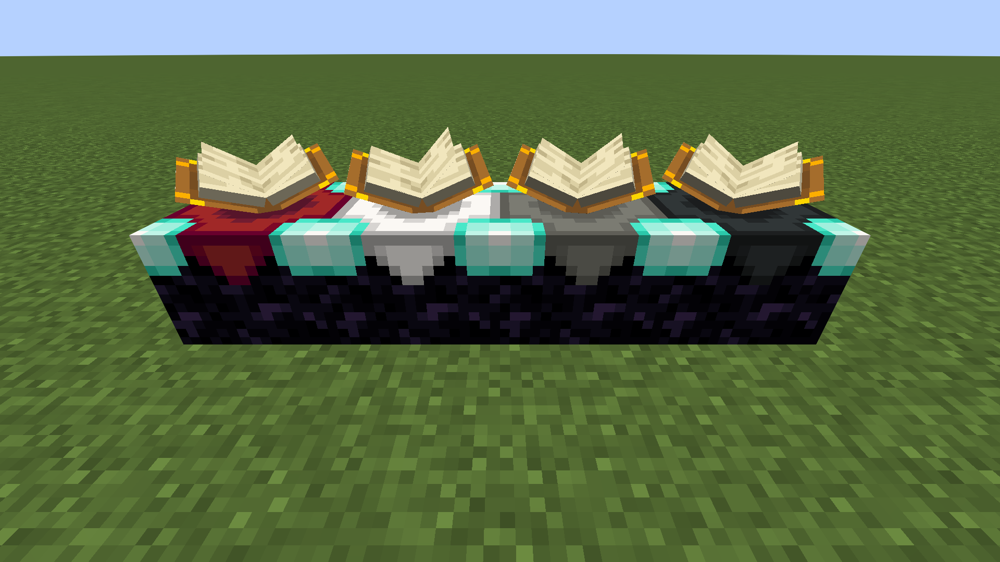
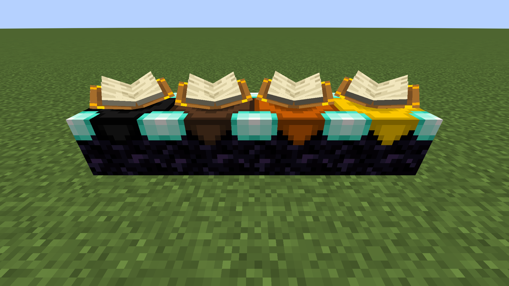
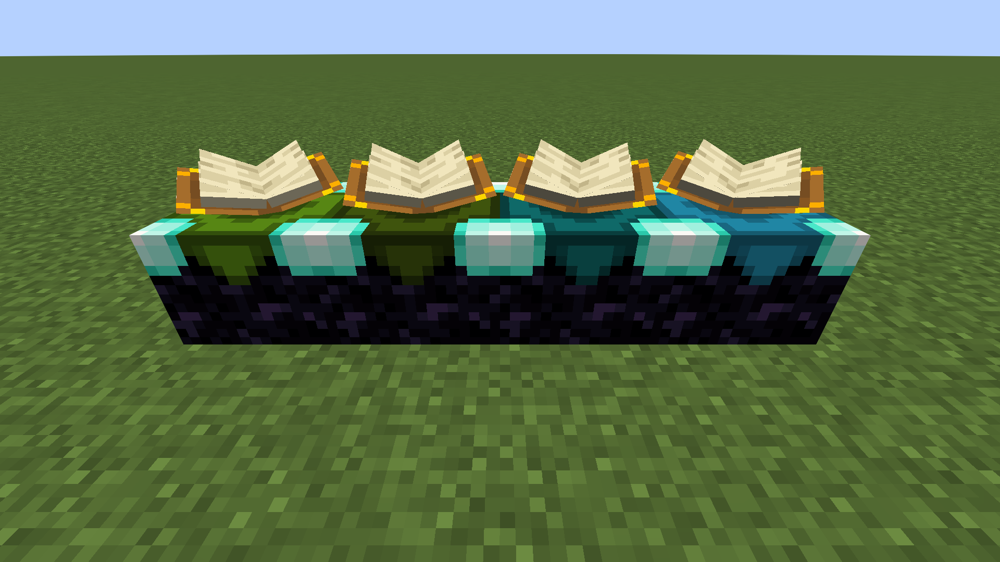
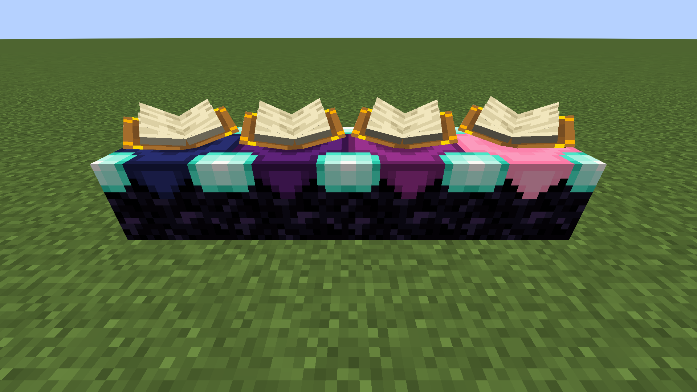
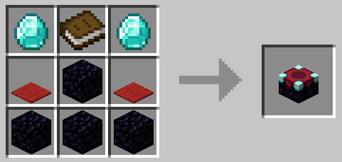
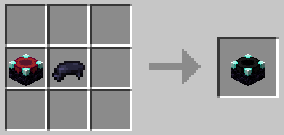

# Colourful Enchanting Tables
A simple 1.21 mod that adds coloured variations of the enchanting table for all of Minecraft's 16 primary colours.
# Links
* [Modrinth (Fabric)](https://modrinth.com/mod/colourful-enchanting-tables)
# Images

  
  

  
  

# Recipes

  
  

