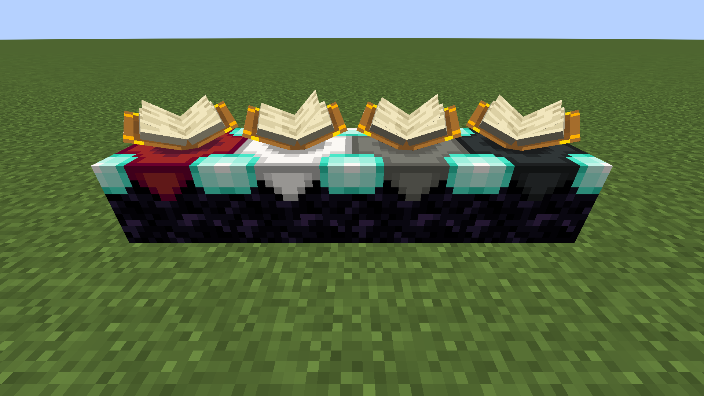
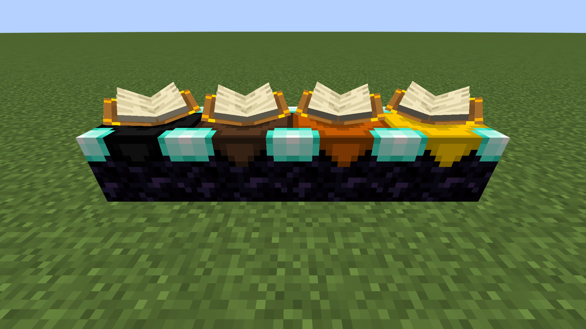
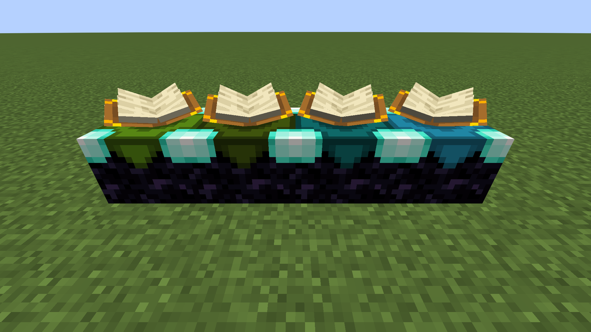
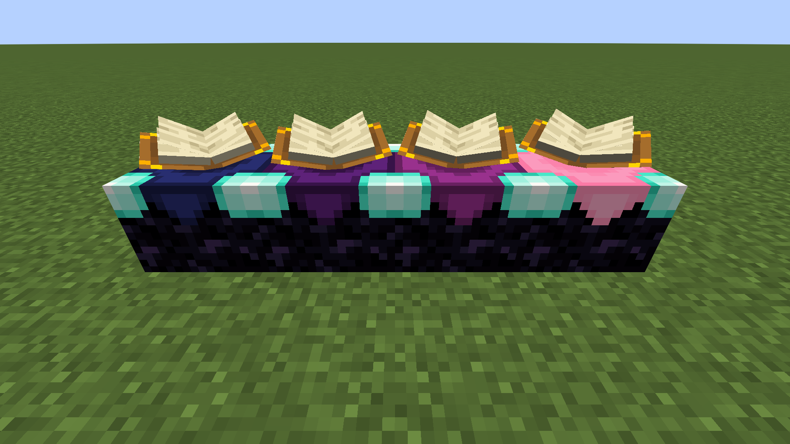
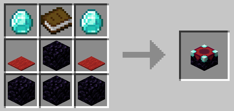
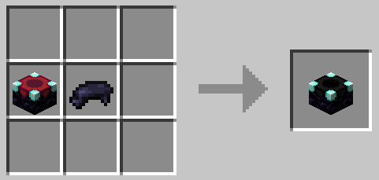
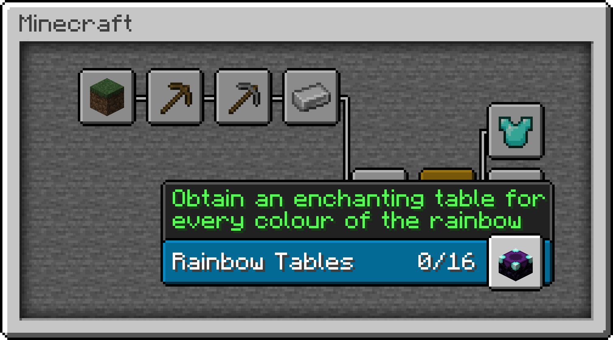

# Colourful Enchanting Tables (Fabric 1.18.2)  
A simple mod that adds coloured variations of the enchanting table for all of Minecraft's 16 primary colours.
# Images

  
  

  
  

# Recipes

  
  

# Advancements

